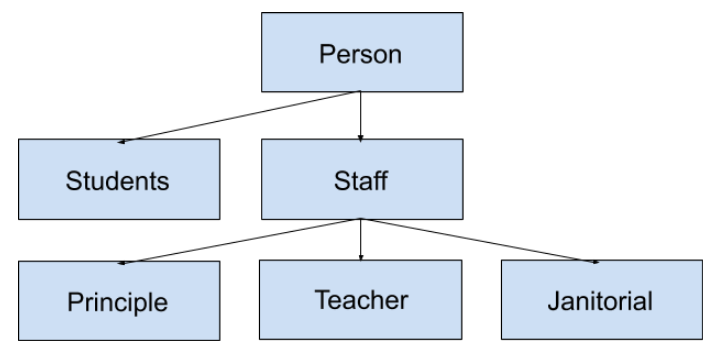

# OOP_Training
A demo of a managment system to emphasize OOP concepts

This particular demo showcases a simplistic school managment system. The class heirarchy of the this system is as follows.

The structure is designed as such to allow the application of a majority of concepts related to Inheritance and Polymorhism. 
